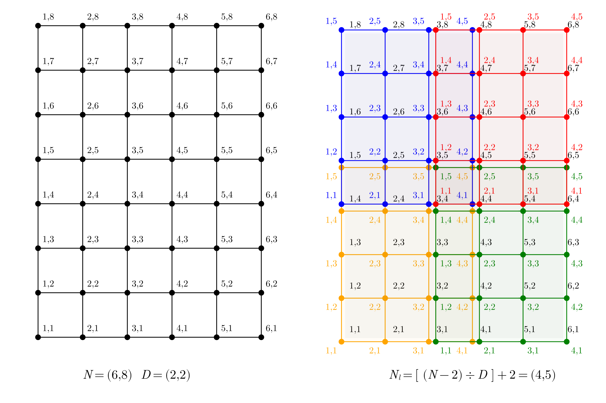
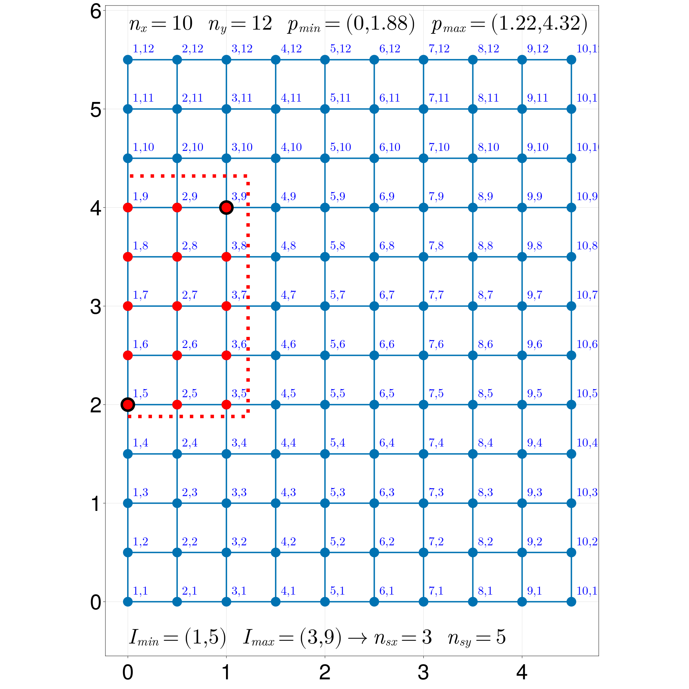
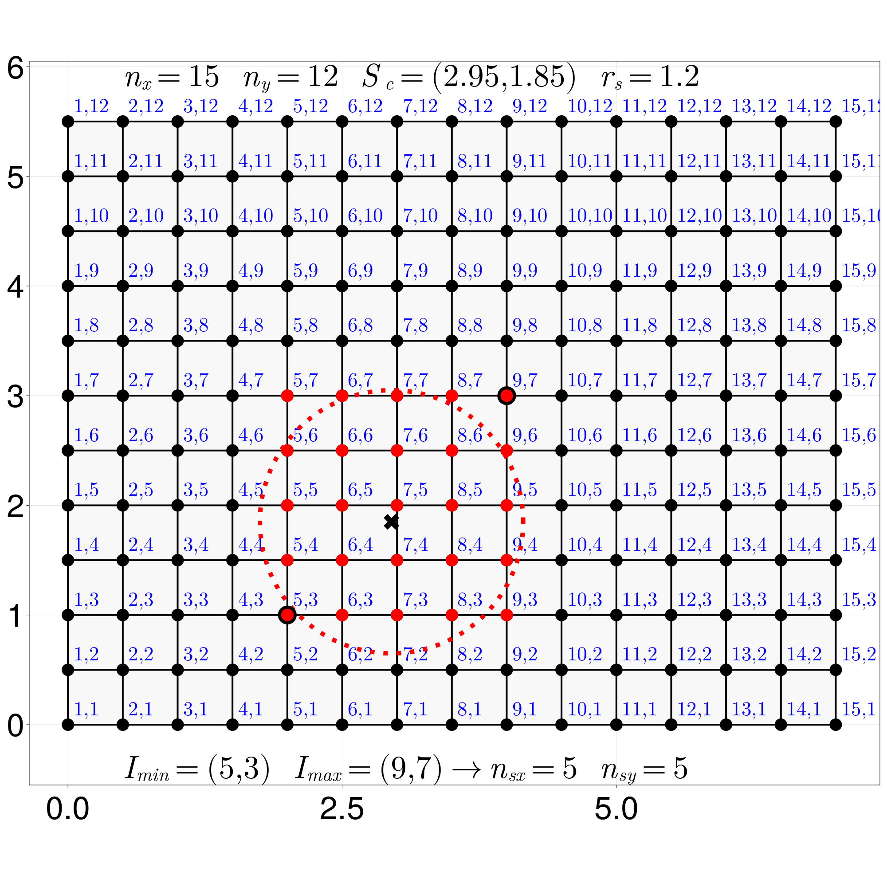

# MakieDrawings.jl

````julia
    using MakieDrawings
     MakieDrawings.drawsplit()
````     



````julia
    using MakieDrawings
     MakieDrawings.drawsensor2D()
````     


````julia
    using MakieDrawings
     MakieDrawings.drawsource2D()
````     

